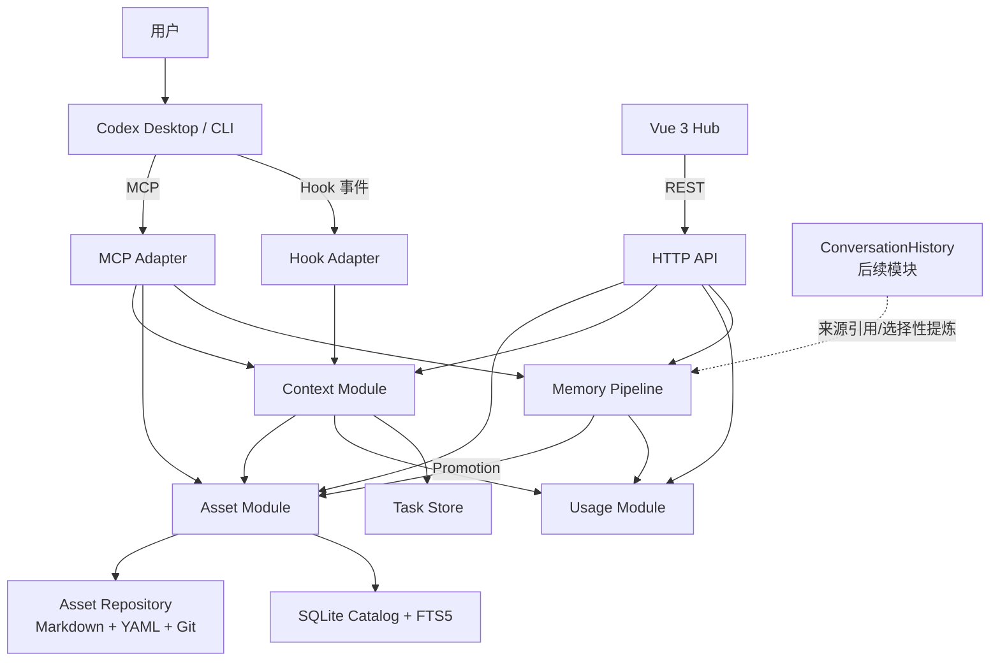

# Engineering Memory Next 新项目设计方案

> 项目代号：Engineering Memory Next（下文简称 **EM Next**）  
> 文档状态：设计基线 v1.0  
> 目标形态：个人定制化的 Codex 知识与上下文系统  
> 技术基线：Node.js 22.16.0 + TypeScript + Vue 3 + SQLite + Markdown + Git  
> 核心接入：Codex Hook + MCP，不使用 MemoryProxy，不要求模型 API Key

---

## 0. 文档使用规则

这份文档既是系统设计，也是后续开发的任务总表。工程量较大，禁止在一个 Codex 对话中连续完成多个任务。

### 0.1 固定执行方式

1. 每个编号任务只在一个全新的 Codex 对话中完成。
2. 新对话开始时，必须先读取：
   - 本文档；
   - 当前任务的详细说明；
   - 上一个任务的完成记录；
   - 当前仓库的实际代码和测试结果。
3. 当前任务只能实现其“范围内”内容，不得顺手实现后续任务。
4. 任务结束前必须：
   - 运行本任务要求的测试；
   - 更新本文档顶部的任务状态表；
   - 在对应任务的“完成记录”中填写简短总结；
   - 写明修改文件、测试结果、遗留问题和下一任务前置条件。
5. 新任务不得依赖上一轮聊天上下文，只能依赖已经提交到 Git 的代码、文档和完成记录。
6. 设计与实际代码不一致时，先停止扩展，实现者必须在当前任务中修正文档或提交明确的设计变更记录，不能自行猜测。

### 0.2 状态定义

| 状态 | 含义 |
|---|---|
| 未开始 | 尚未实施 |
| 进行中 | 当前唯一允许开发的任务 |
| 已完成 | 验收条件全部通过，并已填写完成记录 |
| 阻塞 | 存在明确外部依赖，必须记录原因 |
| 取消 | 经设计变更确认后不再实施 |

### 0.3 防止模型幻觉和跨任务漂移

- 重要契约必须落到 Schema、测试和文件格式中，不能只写在提示词里。
- 每个任务开始前先验证当前代码，不接受“上一轮应该已经实现”的假设。
- 每个任务必须有可执行的验收条件，不能只以“代码已生成”作为完成标准。
- 任何数据格式变更都必须增加兼容性测试或迁移脚本。
- 不允许同时大改领域模型、存储格式、接口和前端页面；一次任务只改变一个主要边界。
- 任务失败或只完成一部分时，应如实标记“进行中”或“阻塞”，不得写成“已完成”。

---

## 1. 项目定位

EM Next 不是团队知识平台，也不是通用的 LLM 网关。它要解决的是：

> 让每个使用者把自己的 Memory、Document、Skill 整理成可追溯、可检索、可按任务组合的个人 Asset，并让 Codex 在正确的任务中只获取真正需要的上下文。

系统面向个人本地使用，允许不同职业的人建立完全不同的知识结构，例如：

- 后端开发：项目规则、设计文档、排障经验、代码审查 Skill；
- 前端开发：组件约束、交互规范、页面实现流程；
- 产品经理：业务背景、需求决策、PRD 方法；
- 测试人员：测试策略、历史缺陷、回归检查流程。

系统不预设固定的“开发、审查、方案、排障”枚举。用户可以用自然语言定义任意任务场景。

---

## 2. 目标与非目标

### 2.1 核心目标

1. 用统一 Asset 模型管理 `MEMORY`、`DOCUMENT`、`SKILL`。
2. 用 Markdown 保存知识原文，用 Git 保存版本历史。
3. 用 SQLite 保存可重建索引、任务运行记录和 Usage 数据。
4. 根据当前 Workspace、任务对象、动作和产物生成 Task Loadout。
5. 严格限制自动注入量，大部分长内容由 Codex 按需读取。
6. 保留并重建旧项目中已经验证有效的 Proposal、Human Confirmed、Promotion、Digest、Receipt、Recall / Read / Used 机制。
7. 提供一个理解 Asset、Context、Usage 和 Git 的 Web Hub。
8. 通过 MCP 和 Hook 服务 Codex 会员链路，不接管 Codex 到模型的请求。
9. 每次任务都能说明：加载了什么、为什么加载、读取了什么、最终使用了什么。
10. 支持从旧项目安全、可回滚地迁移数据。

### 2.2 当前明确不做

- Team、组织、角色、ACL、多人协作；
- Agent 实体和多 Agent 编排；
- MemoryProxy 或模型请求转发；
- 远程云服务、多租户、账号体系；
- 把 CodeGraph 存成 Asset；
- 内置完整代码仓库副本；
- 重新实现 Obsidian 的 Canvas、插件生态、复杂文件树和双向链接编辑器；
- 自动调用外部 LLM 提炼全部历史会话；
- 一开始就做向量数据库和复杂语义检索；
- 一开始就做自动修改 Loadout 的“自学习系统”。

---

## 3. 核心设计原则

### 3.1 Markdown + Git 是知识原件

- Asset 的正文和配置以文件为准。
- Git 负责版本、Diff、回滚和历史追踪。
- SQLite 中的 Asset Catalog 和全文索引必须能够通过扫描 Asset Repository 重建。
- Usage、Task、Settlement 等运行数据只存在于 SQLite，需要独立备份。

### 3.2 Asset 是知识，不是所有数据的总称

进入 Asset 的内容：

- `MEMORY`：短小、明确、可以直接复用的事实、规则、决策和经验；
- `DOCUMENT`：需要完整阅读的设计、说明、复盘和背景文档；
- `SKILL`：可以重复执行的一套工作方法、判断规则和验收流程。

不进入 Asset 的内容：

- 源代码；
- CodeGraph 图数据；
- 原始对话全文；
- Recall / Read / Used 事件；
- Task Loadout；
- 搜索索引和缓存；
- 普通运行日志。

### 3.3 “通用”不是 Asset 类型

Asset 的三个维度分开表达：

- `kind`：它是什么，`MEMORY / DOCUMENT / SKILL`；
- `scope`：它在哪里有效，`GLOBAL / WORKSPACE / TASK`；
- `domains`：它属于什么工作领域，例如 `engineering`、`product`、`testing`，允许用户自定义。

因此“跨项目工程通用内容”应表达为：

```yaml
kind: SKILL
scope: GLOBAL
domains:
  - engineering
```

而不是新增 `COMMON` 或 `ENGINEER_COMMON` 类型。

### 3.4 Loadout 只装“最低必要上下文”

Task Loadout 不是所有相关资料的并集，而是：

> 当前任务不看就很容易犯原则性错误的少量内容，加上一份可按需读取的资料目录。

### 3.5 Context 负责选择，Usage 负责评价

- Context 生成 Task Loadout，并产生 `SELECTED / INJECTED / AVAILABLE` 事件；
- MCP 读取 Asset 时产生 `READ` 事件；
- 任务结束时由任务收口流程提交 `USED / VALIDATED / OUTCOME`；
- Usage 模块保存和结算事件，不反向决定本轮该加载什么。

### 3.6 不依赖额外模型 API

任务含义由正在工作的 Codex 结构化后调用 `context_resolve`。后端不再额外调用一个 LLM 做分类。

---

## 4. 总体架构



### 4.1 运行形态

- 一个本地 Node.js 常驻进程；
- 监听 `127.0.0.1`，默认不对局域网开放；
- 同时提供 REST API、MCP Streamable HTTP、静态 Vue 页面；
- 一个 Asset Git Repository；
- 一个 SQLite 数据库；
- Node 后端不是模型代理，不位于 Codex 与 OpenAI 之间。

---

## 5. 技术基线

| 领域 | 选择 | 说明 |
|---|---|---|
| Node.js | **22.16.0**，约束为 `>=22.16.0 <23` | 参考 TencentDB-Agent-Memory 当前共同基线，避免无必要追逐更新版本 |
| 包管理 | pnpm workspace | 用 `packageManager` 字段和 lockfile 固定实际版本 |
| 语言 | TypeScript，`strict: true` | 后端、前端、MCP 和契约统一使用 TypeScript |
| 后端 HTTP | Hono + Node Adapter | 轻量、本地服务足够，避免 NestJS 式过度框架化 |
| MCP | 官方 TypeScript SDK | 第一版使用 Streamable HTTP；STDIO 作为后续兼容项 |
| 前端 | Vue 3 + TypeScript + Vite | 本地 SPA，不做 SSR，不使用 Nuxt |
| 请求/数据校验 | Zod | 同一 Schema 供 REST、MCP、文件解析和前端类型推导使用 |
| 数据库 | SQLite + better-sqlite3 | 本地单进程，事务明确；通过 Repository 接口隔离驱动 |
| 全文检索 | SQLite FTS5 + 中文分词 | MVP 不依赖 Embedding API；中文内容在入库前分词 |
| 中文分词 | `@node-rs/jieba` 或等价实现 | 精确版本由初始化任务锁定，不进入领域层 |
| Git | 系统 Git CLI + 受控封装 | Git 是正式版本系统，禁止自己实现 Git 语义 |
| 测试 | Vitest + API 集成测试；Hub 关键路径使用 Playwright | 每个阶段必须有自动化验收 |
| 日志 | 结构化本地日志 | 不引入 OpenTelemetry、Kafka、ClickHouse 等团队化设施 |

### 5.1 为什么不使用 NestJS

项目需要的是明确的模块边界，而不是企业级装饰器和依赖注入体系。Hono 配合显式依赖传入、Zod Schema 和模块化目录已经足够。

### 5.2 为什么暂不使用向量检索

- 当前没有独立 Embedding API；
- 本地模型会增加安装体积和运行复杂度；
- Workspace、Scope、任务对象、动作、Asset 标题和中文分词已经能提供较强约束；
- 先用实际 Usage 数据验证 FTS5 的遗漏，再决定是否增加可选的本地 Embedding。

---

## 6. 仓库与运行数据结构

### 6.1 应用源码仓库

```text
engineering-memory-next/
├── apps/
│   ├── server/                 # Hono、REST、MCP、本地服务入口
│   └── hub/                    # Vue 3 SPA
├── packages/
│   ├── contracts/              # Zod Schema 和跨端契约
│   ├── asset-format/           # Asset Repository 文件格式解析
│   ├── domain/                 # 纯领域模型和规则
│   └── test-fixtures/          # 测试样本
├── docs/
│   ├── design/                 # 设计文档
│   ├── progress/               # 任务进度与完成记录
│   └── adr/                    # 重要架构决策
├── scripts/
├── package.json
├── pnpm-workspace.yaml
├── .nvmrc                      # 22.16.0
└── AGENTS.md
```

禁止建立一个无限膨胀的 `shared` 包。只有 Schema、错误码和无副作用纯函数允许跨应用共享。

### 6.2 用户 Asset Repository

Asset 内容不能和开源工具代码混在同一个 Git 仓库。默认使用独立路径：

```text
~/.engineering-memory/asset-repository/
├── repository.yaml
├── global/
│   ├── engineering/
│   ├── product/
│   └── testing/
├── workspaces/
│   ├── xm-ai-job/
│   │   ├── workspace.yaml
│   │   ├── assets/
│   │   │   ├── memory/
│   │   │   ├── document/
│   │   │   └── skill/
│   │   └── context-profiles/
│   └── engineering-memory/
│       ├── workspace.yaml
│       ├── assets/
│       └── context-profiles/
└── .git/
```

开发环境允许把该路径配置成任意目录，但 Asset Repository 必须自己单独初始化 Git。

### 6.3 运行数据

```text
~/.engineering-memory/runtime/
├── engineering-memory.db
├── logs/
├── backups/
└── temp/
```

---

## 7. 核心领域模型

### 7.1 Workspace

Workspace 表示一组业务或工作上下文，不强制等同于代码仓库。

```ts
interface Workspace {
  id: string;
  name: string;
  rootPaths: string[];
  repositoryRemote?: string;
  defaultDomains: string[];
}
```

可用于：代码项目、产品空间、测试项目、个人通用工作区。

### 7.2 Asset

```ts
type AssetKind = 'MEMORY' | 'DOCUMENT' | 'SKILL';
type AssetScope = 'GLOBAL' | 'WORKSPACE' | 'TASK';

interface AssetManifest {
  schemaVersion: 1;
  id: string;
  kind: AssetKind;
  title: string;
  summary: string;
  scope: AssetScope;
  workspaceId?: string;
  taskId?: string;
  domains: string[];
  entry: string;
  sourceRefs: string[];
  createdAt: string;
  updatedAt: string;
}
```

MVP 不提供手工数字优先级、启用开关、ACL 和复杂标签。

### 7.3 Context Profile（界面名称：任务场景）

它描述“一类任务需要哪些最低前置资料”，不是固定工作模式枚举。

```ts
interface ContextProfile {
  schemaVersion: 1;
  id: string;
  name: string;
  workspaceId?: string;
  domains: string[];
  examples: string[];
  objectHints: string[];
  actionHints: string[];
  deliverableHints: string[];
  requiredAssetIds: string[];
}
```

示例：

```yaml
id: ctx-xm-recharge-design
name: 用工项目 / 充值链路 / 调整方案设计
workspaceId: xm-ai-job
domains: [engineering]
examples:
  - 设计充值链路调整方案
  - 评估充值回调改造
objectHints: [充值链路, 充值回调, 账户充值]
actionHints: [方案设计, 调整改造, 技术评估]
deliverableHints: [技术方案, 设计结论]
requiredAssetIds:
  - ast-recharge-rules
  - ast-account-model
  - ast-recharge-history-decisions
```

### 7.4 Task

```ts
interface TaskRecord {
  id: string;
  workspaceId?: string;
  sessionId?: string;
  originalPrompt: string;
  normalizedObject?: string;
  normalizedAction?: string;
  expectedDeliverable?: string;
  status: 'OPEN' | 'COMPLETED' | 'FAILED' | 'ABORTED';
  codeSnapshot?: GitSnapshot;
  assetSnapshot?: GitSnapshot;
  startedAt: string;
  completedAt?: string;
}
```

### 7.5 Task Loadout

Task Loadout 属于 Context 模块，是某一次任务实际生成的资料清单。

```ts
interface TaskLoadout {
  id: string;
  taskId: string;
  matchedProfileId?: string;
  confidence: 'HIGH' | 'MEDIUM' | 'LOW';
  injected: LoadoutItem[];
  available: LoadoutItem[];
  omitted: OmittedItem[];
  estimatedTokens: number;
  generatedAt: string;
}
```

每个条目必须记录：

- `assetId`；
- 当时的 `contentHash`；
- Asset Git Commit；
- 选择原因；
- 注入或仅可用；
- 摘要长度；
- 来源层级。

### 7.6 Usage Event

```ts
type UsageEventType =
  | 'SELECTED'
  | 'INJECTED'
  | 'AVAILABLE'
  | 'READ'
  | 'USED'
  | 'VALIDATED'
  | 'OUTCOME_SUCCESS'
  | 'OUTCOME_FAILURE';
```

每条事件至少包含：

```text
event_id
task_id
loadout_id
asset_id
asset_content_hash
asset_git_commit
event_type
evidence_ref
occurred_at
```

### 7.7 Proposal

新系统中正式 Asset 不能由 Codex 直接写入。Codex只能提交 Proposal：

```text
PENDING → CONFIRMED → PROMOTED
        ↘ REJECTED
```

Proposal 必须保存来源、证据、摘要和目标 AssetKind。

### 7.8 ConversationReference

当前只定义引用格式，不实现完整会话仓库：

```text
conversation://<source>/<session-id>/<turn-id>
```

ConversationHistory 后续作为独立模块实现。

---

## 8. Asset 文件格式

### 8.1 统一目录形式

每个 Asset 是一个独立目录：

```text
ast-recharge-idempotency/
├── asset.yaml
└── content.md
```

`asset.yaml`：

```yaml
schemaVersion: 1
id: ast-recharge-idempotency
kind: MEMORY
title: 充值回调幂等规则
summary: 充值回调必须按业务订单号防止重复入账
scope: WORKSPACE
workspaceId: xm-ai-job
domains:
  - engineering
entry: content.md
sourceRefs:
  - legacy-memory://confirmed/123
createdAt: 2026-09-03T00:00:00Z
updatedAt: 2026-09-03T00:00:00Z
```

### 8.2 Document Asset

```text
ast-recharge-design/
├── asset.yaml
├── content.md
└── resources/
    └── recharge-flow.drawio
```

项目专属设计文档只在 Asset Repository 中保存正式副本，不再复制到代码仓库的 `docs` 分支。

### 8.3 Skill Asset

```text
ast-java-code-review/
├── asset.yaml
├── SKILL.md
└── resources/
    ├── checklist.md
    └── examples.md
```

一个内容是否是 Skill，不由目录或压缩格式决定，而由语义决定。成为 Skill 至少需要：

1. 可以用于多次相似任务；
2. 有明确步骤、判断规则或检查流程；
3. 有明确输入和预期输出；
4. 能判断是否完成或正确。

### 8.4 内容 Hash

- `contentHash` 由系统根据 `asset.yaml` 的规范化内容、入口文件及资源文件列表计算；
- Hash 不要求手工写入文件；
- Task Loadout 和 Usage 必须同时记录 `asset_id + content_hash`，避免 Asset 修改后无法还原当时使用的版本。

### 8.5 原子写入

所有 Hub 和 API 写入必须：

1. 写入临时文件；
2. 校验 YAML、路径和 Asset Schema；
3. 原子替换目标文件；
4. 更新索引；
5. 失败时恢复原文件；
6. 不自动 Git Commit，除非后续明确增加该功能。

---

## 9. 项目文档与代码版本对应

项目文档不进入代码发布分支，正式原件只保存在 Asset Repository。代码和文档通过 Task Snapshot 关联，而不是复制文件。

```ts
interface GitSnapshot {
  repositoryPath: string;
  branch?: string;
  headCommit?: string;
  dirty: boolean;
  changedPaths: string[];
  capturedAt: string;
}
```

任务开始和结束时分别记录：

```text
代码仓库 Commit / Dirty 状态
Asset Repository Commit / Dirty 状态
```

某次上线可以记录：

```text
release_id
code_commit
asset_commit
related_task_ids
```

后续版本可增加“文档过期提醒”：Document 记录关联代码路径，当这些路径在 `verifiedCodeCommit` 后发生变化时，仅提示“可能过期”，不自动修改文档。

---

## 10. Context 与 Loadout 设计

### 10.1 任务识别方式

不要求用户输入 `$code-review` 一类固定命令。Codex 在任务开始时根据用户原话调用：

```json
{
  "workspaceId": "xm-ai-job",
  "originalPrompt": "按照之前方案调整充值回调并补测试",
  "object": "充值回调",
  "action": "代码实现",
  "expectedDeliverable": "代码与测试",
  "changedFiles": ["RechargeCallbackService.java"]
}
```

后端使用以下信息匹配 Context Profile：

1. Workspace 精确匹配；
2. 用户显式指定的 Asset 或任务；
3. object / action / deliverable 与 Profile hints；
4. Profile examples 的 FTS5 相似度；
5. changedFiles 与 Asset/Workspace 路径提示；
6. 仅在同 Scope 内搜索。

### 10.2 置信度处理

| 置信度 | 行为 |
|---|---|
| HIGH | 注入该 Profile 的少量 required Asset 摘要 |
| MEDIUM | required Asset 只进入 available 列表，不自动注入全文 |
| LOW | 不使用场景专属 Loadout，只返回个人/Workspace 基础入口 |

原则：识别不准时宁可少给，不猜着多给。

### 10.3 选取顺序

```text
用户本次明确指定
    > 当前 Task Scope
    > 匹配的 Context Profile
    > Workspace 核心约束
    > Global 通用约束
    > 动态搜索候选
```

冲突内容不得同时直接注入。系统应优先保留更具体 Scope、更新 Hash 对应版本，并将被排除内容记录到 `omitted`。

### 10.4 注入分层

1. **直接注入**：最多 3～5 条短规则或不可违反的决定；
2. **可用资料目录**：只给标题、一句话摘要和 Asset ID；
3. **按需读取**：完整 Document、Skill、原始证据和其他长内容通过 MCP 读取。

### 10.5 MVP 硬上限

初始默认值：

```text
直接注入 Asset：最多 5 个
直接注入总预算：最多约 2,000 tokens
单条摘要：最多约 250 tokens
可用资料目录：最多 10 个
完整 Document / Skill：永不自动全文注入
```

Token 估算不作为安全边界，最终同时保留字符上限。具体数值由真实使用数据调整，但 MVP 不提供每个 Profile 的复杂调参页面。

### 10.6 Loadout 不是静态复制

Profile 只保存 required Asset ID。每次生成 Loadout 时必须重新读取当前 Asset Hash 和 Git 状态，防止使用陈旧缓存。

---

## 11. Asset 搜索设计

### 11.1 MVP 搜索来源

- Asset ID；
- 标题；
- 摘要；
- 正文；
- Workspace；
- kind；
- scope；
- domains；
- sourceRefs。

### 11.2 中文与代码混合检索

索引前生成两份文本：

- 原始文本，用于精确短语和展示；
- 分词文本，用于 FTS5/BM25。

分词时保留：

- Java 类名、方法名、表名；
- 下划线和驼峰拆词；
- 中文词语；
- Asset ID 和 Workspace ID。

### 11.3 MVP 排序

```text
BM25 基础分
+ Workspace 精确匹配
+ Scope 精确匹配
+ 标题命中
+ 用户显式引用
+ Context Profile required 命中
```

不因“最近更新”自动获得很高权重，避免新但错误的资料覆盖稳定规则。

---

## 12. Usage 与任务收口

### 12.1 事件产生者

| 事件 | 产生模块 |
|---|---|
| SELECTED | Context Resolver |
| INJECTED | Context Builder |
| AVAILABLE | Context Builder |
| READ | Asset MCP 读取接口 |
| USED | 任务收口，由 Codex 提交并附证据 |
| VALIDATED | 测试、Review 或人工确认 |
| OUTCOME_SUCCESS / FAILURE | Task Complete |

### 12.2 `task_complete`

每个 Codex 任务结束时调用一次：

```json
{
  "taskId": "task_xxx",
  "summary": "完成充值回调幂等调整并补充测试",
  "usedAssets": [
    {
      "assetId": "ast-recharge-idempotency",
      "evidence": "实现沿用业务订单号幂等键，相关测试通过"
    }
  ],
  "validation": {
    "commands": ["pnpm test"],
    "result": "PASS"
  },
  "outcome": "SUCCESS",
  "proposals": []
}
```

Agent 自述只能作为证据之一。能够关联测试、代码 Diff、用户确认时，应优先记录这些确定性证据。

### 12.3 结算

Usage Settlement 至少支持：

- 某 Asset 被注入但从未读取；
- 被读取但未使用；
- 被使用并通过验证；
- 使用后任务失败；
- 旧版本与新版本分别统计。

MVP 只记录和展示，不自动调整 Profile。

---

## 13. Memory Pipeline

### 13.1 新知识产生方式

由于不使用额外模型 API，候选知识由当前 Codex 在任务收口时提交 Proposal，或由用户在 Hub 中手工创建。

```text
任务完成
→ Codex 提交 Proposal
→ Schema 校验与去重
→ 用户确认或拒绝
→ Promotion
→ 写入 Asset Repository
→ 更新 Git 工作区和索引
```

### 13.2 必须保留的旧系统能力

- 来源引用；
- Semantic Digest；
- Human Confirmed；
- Promotion 状态；
- HMAC Receipt 或等价完整性证明；
- 事务失败回滚；
- Catalog freshness；
- Recall / Read / Used 结算。

### 13.3 Hub 中的最小审核

不做复杂审核中心。Task Context 页面只提供：

- 查看当前任务产生的 Proposal；
- Accept；
- Reject；
- 修改标题、摘要和正文后 Accept。

---

## 14. ConversationHistory 模块边界

ConversationHistory 有价值，但不进入第一版主线。

未来职责：

- 导入和保存 Codex 历史会话；
- 搜索原始对话；
- 作为 Asset 的证据来源；
- 做“历史会话是否已经沉淀”的缺口检查；
- 只对可能遗漏的高价值会话进行选择性提炼。

当前只预留：

- `sourceRefs`；
- ConversationReference Schema；
- 未来数据库迁移扩展点。

不做全量历史会话重新提炼，不让该模块阻塞 EM Next 上线。

---

## 15. CodeGraph 的处理

CodeGraph 是 Codex 可用能力，不是 Asset。

- 全局 `AGENTS.md` 简短说明存在 CodeGraph 工具；
- 只有已经建立 CodeGraph 的项目才在项目级 `AGENTS.md` 中说明使用条件；
- 简单任务不强制调用；
- Context Profile 不绑定 CodeGraph 数据；
- Task 运行记录可以记录 Codex 是否调用过 CodeGraph，但不复制图数据。

---

## 16. Hub MVP

Hub 的定位是：

> 一个理解 Markdown、Git、Asset、Context 和 Usage 的个人知识工作台，而不是另一个通用笔记软件。

### 16.1 页面一：Asset Library

必须功能：

- 全文搜索；
- 按 Workspace、kind、scope、domain 筛选；
- Markdown 预览；
- 显示 Asset ID、路径、Git 状态、当前 Hash；
- 显示来源和最近任务使用情况；
- 在系统编辑器或 IDEA 中打开文件；
- 简单 Markdown 编辑与保存。

不做：文件夹拖拽、Canvas、复杂富文本、插件体系、多人协作。

### 16.2 页面二：Task Context

必须功能：

- 查看 Task 基本信息；
- 查看匹配到的 Context Profile 和置信度；
- 查看 injected / available / omitted；
- 查看每项为什么被选中；
- 查看估算上下文占用；
- 查看 Recall / Read / Used / Outcome；
- 查看当前任务产生的 Proposal 并做最小确认。

### 16.3 页面三：Repository Status

可以是轻量抽屉或状态栏，不要求独立复杂页面：

- Asset Repository 路径；
- Git Branch、Commit、Dirty 状态；
- SQLite 索引状态；
- 最近一次扫描时间；
- 手动重新扫描；
- 备份入口。

### 16.4 MVP 不做的 Hub 功能

- 复杂标签维护；
- 手工数字优先级；
- Asset 启用/停用；
- 关系图谱；
- 团队、权限、分享；
- 自动 Git 合并；
- 数据大屏；
- 自定义 Dashboard。

---

## 17. REST 与 MCP 边界

### 17.1 REST API

服务 Hub，路径建议：

```text
/api/assets
/api/workspaces
/api/context-profiles
/api/tasks
/api/tasks/:id/loadout
/api/tasks/:id/usage
/api/proposals
/api/repository/status
```

### 17.2 MCP 工具 MVP

工具数量控制在最小集合：

1. `context_resolve`：创建/恢复 Task，生成 Loadout；
2. `asset_search`：在指定 Scope 内搜索 Asset；
3. `asset_read`：读取完整 Asset，并记录 READ；
4. `task_complete`：提交任务总结、Used、验证结果和 Proposal；
5. `task_status`：查看当前 Task 和 Loadout，便于新会话恢复。

不为每种 Asset 建一套重复工具。

### 17.3 Hook

Hook 只做：

- 识别当前目录和 Git Repository；
- 注入一段很短的使用协议；
- 将 Session / Turn 等可获取标识传给本地服务；
- 不直接拼接大段 Memory；
- 不替代 `context_resolve`。

---

## 18. SQLite 数据边界

建议初始表：

```text
schema_migration
workspace_index
asset_catalog
asset_fts
context_profile_index
task
task_loadout
task_loadout_item
usage_event
usage_settlement
proposal
promotion_record
integrity_receipt
legacy_id_map
```

### 18.1 可重建数据

- `workspace_index`；
- `asset_catalog`；
- `asset_fts`；
- `context_profile_index`。

### 18.2 不可仅靠文件重建的数据

- Task；
- Task Loadout；
- Usage Event / Settlement；
- Proposal / Promotion；
- Receipt；
- Legacy ID Map。

这些表必须纳入备份。

---

## 19. 安全与可靠性

1. 默认只监听 `127.0.0.1`。
2. 所有文件路径必须在配置的 Asset Repository 内，防止路径穿越。
3. Asset ID、入口文件和资源路径必须通过 Schema 校验。
4. SQLite 开启外键、WAL 和适当 busy timeout。
5. 文件写入与 SQLite 更新失败时必须可恢复，不允许半写入。
6. Git 命令必须使用参数数组调用，禁止拼接 Shell 字符串。
7. Hub 不直接执行任意系统命令。
8. 打开外部编辑器使用白名单命令或系统默认打开方式。
9. 日志不得记录完整敏感正文，正文只记录 ID 和 Hash。
10. 迁移与批量操作前自动生成数据库和 Asset Repository 快照。

---

## 20. 测试策略

### 20.1 单元测试

- Asset Schema；
- Scope 规则；
- Skill 判定规则的结构校验；
- 中文分词和代码词拆分；
- Context Profile 匹配；
- Loadout 去重、冲突和预算裁剪；
- Usage 状态转换；
- Hash 计算和路径安全。

### 20.2 集成测试

- 扫描文件 → Catalog → Search → Read；
- 修改文件 → Hash 更新 → 索引刷新；
- `context_resolve` → Loadout → `asset_read` → `task_complete`；
- Proposal → Confirm → Promotion → Git 工作区；
- SQLite 事务失败和文件回滚；
- MCP Streamable HTTP。

### 20.3 端到端测试

至少覆盖：

1. 新建一个 Workspace 和三个 Asset；
2. 通过 Codex 风格请求生成 Loadout；
3. 读取 Document；
4. 完成 Task 并提交 Used；
5. 在 Hub 查看完整链路；
6. 提交 Proposal 并 Promotion；
7. 重启服务后数据仍然一致。

### 20.4 Golden Cases

使用固定样例验证：

- “用工项目 / 充值链路 / 方案设计”；
- “用工项目 / 充值链路 / 代码实现”；
- 相同对象、不同动作必须得到不同 Loadout；
- 无法识别的任务不得注入大量场景 Asset。

---

## 21. 分阶段任务总表

> 每个任务必须在独立的新对话中完成。状态和简短总结在任务结束时更新。

| 任务 | 阶段 | 内容 | 状态 | 完成 Commit | 简短总结 |
|---|---|---|---|---|---|
| N00 | 基线 | 冻结设计、建立 ADR 与任务执行协议 | 未开始 | - | - |
| N01 | 基线 | 初始化 Node/TS/pnpm Monorepo 与质量门禁 | 未开始 | - | - |
| N02 | 契约 | 定义核心 Zod Schema 和错误模型 | 未开始 | - | - |
| N03 | Asset | 实现 Asset Repository 文件扫描与解析 | 未开始 | - | - |
| N04 | Asset | 实现 SQLite Catalog、迁移和 FTS5 搜索 | 未开始 | - | - |
| N05 | Asset | 实现 Git 快照、Hash、原子写入和刷新 | 未开始 | - | - |
| N06 | Asset | 实现 Asset Service、REST 与基础测试 | 未开始 | - | - |
| N07 | Context | 实现 Workspace、Task 与 Git Context 捕获 | 未开始 | - | - |
| N08 | Context | 实现 Context Profile 解析与匹配 | 未开始 | - | - |
| N09 | Context | 实现 Task Loadout、预算和 Manifest | 未开始 | - | - |
| N10 | Usage | 实现 Usage Event 与 Settlement | 未开始 | - | - |
| N11 | Task | 实现 task lifecycle 和 task_complete | 未开始 | - | - |
| N12 | Memory | 实现 Proposal、Confirm、Promotion 与 Receipt | 未开始 | - | - |
| N13 | MCP | 实现五个 MVP MCP 工具和协议测试 | 未开始 | - | - |
| N14 | Hub | 实现 Asset Library / Detail | 未开始 | - | - |
| N15 | Hub | 实现 Task Context / Proposal 最小审核 | 未开始 | - | - |
| N16 | Codex | 接入 Hook、AGENTS.md 和真实 Codex 联调 | 未开始 | - | - |
| N17 | 稳定性 | 端到端测试、备份恢复、打包与运行脚本 | 未开始 | - | - |
| N18 | 验收 | Shadow 使用、消融对比与迁移准入评审 | 未开始 | - | - |

### 21.1 与迁移任务的推荐总顺序

两个文档不是各自从头到尾完全独立执行。推荐按照以下依赖顺序推进：

```text
N00 → N01 → N02
→ M00 → M01 → M02
→ N03 → N04 → N05 → N06
→ M03 → M04 → M05 → M06
→ N07 → N08 → N09 → N10 → N11 → N12 → N13 → N14 → N15 → N16 → N17
→ M07 → M08 → M09 → M10 → M11
→ N18
→ M12 → M13
```

说明：

- M00～M02 只盘点和导出，可在新系统核心实现前完成；
- M03～M06 依赖 Asset 文件契约、Catalog 和写入能力；
- M07 依赖新 Usage / Task；
- M08 依赖新 Proposal / Promotion / Receipt；
- M11 依赖真实 Codex 接入；
- N18 只有在迁移 Dry Run 和 Shadow 完成后才能验收；
- M12 正式切换必须晚于 N18。

---

## 22. 各任务详细说明

### N00：冻结设计、建立 ADR 与任务执行协议

**目标**

把本文档转入新仓库，建立不会依赖聊天上下文的执行机制。

**范围内**

- 创建 `docs/design`、`docs/progress`、`docs/adr`；
- 创建项目状态文件和任务完成记录模板；
- 创建 ADR：技术栈、Asset 原件、无 Proxy、无 Agent、SQLite 边界；
- 明确变更设计的流程。

**不做**

- 不初始化业务代码；
- 不修改领域模型。

**验收**

- 新对话只读取仓库文件即可知道下一任务；
- 所有重要决策有 ADR；
- 状态表与本文档一致。

**完成记录（任务结束时填写）**

```text
状态：未填写
Commit：未填写
完成内容：未填写
测试/检查：未填写
遗留问题：未填写
下一任务前置：未填写
```

### N01：初始化 Monorepo 与质量门禁

**目标**

建立 Node.js 22.16.0、pnpm、TypeScript、Hono、Vue 3 的可运行骨架。

**交付**

- `.nvmrc`、`packageManager`、workspace；
- server / hub / contracts / domain 包；
- lint、format、typecheck、test、build；
- CI 或本地统一校验脚本；
- 空白 Hub 能由 server 提供。

**验收**

```text
pnpm install
pnpm lint
pnpm typecheck
pnpm test
pnpm build
```

全部通过，且生产启动只需要一个 Node 进程。

**完成记录**：任务结束时填写状态、Commit、命令结果和异常。

### N02：核心 Schema 和错误模型

**目标**

用 Zod 固定 Workspace、Asset、ContextProfile、Task、TaskLoadout、UsageEvent、Proposal、GitSnapshot 的契约。

**要求**

- 类型由 Schema 推导；
- 文件、REST、MCP 共用同一契约；
- 所有 ID、时间、路径字段有明确校验；
- 提供正反例 Fixtures；
- 错误码不依赖 HTTP 或 MCP 类型。

**验收**

- 非法 scope、越界路径、缺少 Workspace 的 WORKSPACE Asset 均被拒绝；
- Schema 变更有测试。

### N03：Asset Repository 扫描与解析

**目标**

读取独立 Asset Repository，识别 Workspace、Context Profile 和三种 Asset。

**要求**

- 不依赖 SQLite；
- 扫描结果是纯领域对象；
- 忽略 `.git`、临时文件和未知目录；
- 单个损坏 Asset 进入错误报告，不阻断全部扫描；
- 稳定处理中文路径和 Windows/macOS 路径。

**验收**

- 样例仓库扫描结果与 Golden Fixture 完全一致；
- 损坏文件有精确路径和错误原因。

### N04：SQLite Catalog 与 FTS5

**目标**

把扫描结果写入可重建 Catalog，并支持中文和代码词搜索。

**要求**

- 显式 SQL migration；
- `asset_catalog` 与 `asset_fts`；
- 全量重建和增量刷新；
- 删除文件后索引正确清理；
- Repository 接口隔离 better-sqlite3。

**验收**

- 数据库删除后可从 Asset Repository 完整重建；
- 充值、RechargeCallbackService、customer_account_transaction 等查询命中预期结果。

### N05：Git、Hash 与原子写入

**目标**

实现内容版本证据和安全写文件。

**要求**

- 捕获 branch、commit、dirty、changed paths；
- 计算规范化 contentHash；
- Hub/API 修改使用原子写入；
- 写入失败不留下半文件；
- 不自动提交 Git。

**验收**

- 改正文后 Hash 变化；
- 只改无意义换行时按既定规范得到稳定结果；
- 模拟数据库失败后文件恢复。

### N06：Asset Service 与 REST

**目标**

提供 Hub 所需的 Asset 搜索、读取、创建、修改和删除能力。

**MVP 接口**

- list/search；
- detail/read；
- create；
- update；
- delete；
- repository refresh/status。

**验收**

- OpenAPI 或等价接口契约可测试；
- 所有写操作校验路径与 Hash；
- 删除后 Git 可恢复历史。

### N07：Workspace、Task 与 Context 捕获

**目标**

根据当前目录、Git 和 Codex 请求创建 Task，并保存开始快照。

**要求**

- Workspace 解析有确定优先顺序；
- 同一 Session 可创建多个 Task；
- 新对话可通过 taskId 恢复；
- Workspace 不明确时不扩大到其他 Workspace。

**验收**

- 多仓库样例不会串项目；
- dirty 状态和 changed paths 正确保存。

### N08：Context Profile 匹配

**目标**

支持用户自定义任意任务场景，不使用固定模式枚举。

**要求**

- 接收 object/action/deliverable；
- Workspace 作为硬过滤；
- FTS5 + 确定性加权；
- 输出候选、分数和 HIGH/MEDIUM/LOW；
- 低置信度不自动装载 required Assets。

**Golden Case**

“充值链路方案设计”和“充值链路代码实现”必须匹配不同 Profile。

### N09：Task Loadout 与预算

**目标**

生成可解释、受预算限制的 Task Loadout。

**要求**

- injected / available / omitted；
- 最多 5 个直接注入；
- Hash、Git Commit、选择原因完整；
- 去重和冲突处理；
- 生成可审计 Manifest。

**验收**

- 超预算时结果稳定、可解释；
- 完整 Document/Skill 不会被自动全文注入。

### N10：Usage Event 与 Settlement

**目标**

统一记录 Asset 从被选择到产生效果的完整路径。

**要求**

- 事件幂等；
- 非法状态转换被拒绝或明确记录；
- 按 assetId + contentHash 统计；
- 支持任务和 Asset 两种查询视角。

**验收**

- injected 未 read、read 未 used、used success 三类可区分；
-重复上报不重复计数。

### N11：Task 生命周期与收口

**目标**

实现 `OPEN → COMPLETED / FAILED / ABORTED`，并接收任务总结、测试和 Used 证据。

**要求**

- `task_complete` 只能成功结算一次；
- 保存结束时代码和 Asset Git Snapshot；
- 生成简短 handoff；
- 失败任务也必须保留真实状态。

**验收**

- 服务重启后仍能恢复未完成 Task；
- 重复 complete 返回幂等结果或明确冲突。

### N12：Proposal、Promotion 与 Receipt

**目标**

重建可信知识沉淀链路。

**要求**

- Codex 只能创建 Proposal；
- Confirm 后才能 Promotion；
- Promotion 写入 Asset Repository；
- 保存来源、Digest、Receipt；
- 文件和数据库操作可回滚。

**验收**

- 未确认 Proposal 不能被普通 Context 注入；
- Promotion 后生成有效 Asset 并可检索；
- 失败不会留下 Active Asset。

### N13：MCP MVP

**目标**

实现 `context_resolve`、`asset_search`、`asset_read`、`task_complete`、`task_status`。

**要求**

- MCP 类型不得进入 domain 包；
- Streamable HTTP；
- 工具返回结果适合 Codex 阅读，不返回无意义大 JSON；
- asset_read 自动记录 READ。

**验收**

- 使用 MCP Inspector 或协议测试完成完整任务闭环；
- 非法 taskId、assetId 返回结构化错误。

### N14：Hub Asset Library / Detail

**目标**

实现 Asset 搜索、筛选、预览和基本编辑。

**要求**

- 列表与详情；
- Markdown 渲染；
- Git 状态和 Hash；
- 打开外部编辑器；
- 简单编辑保存；
- 不做文件树拖拽和富文本。

**验收**

- 三种 Asset 都能正确展示；
- 修改后 Catalog 和 Git Dirty 状态同步。

### N15：Hub Task Context / Proposal

**目标**

让用户看清本轮 Codex 为什么加载这些资料。

**要求**

- Task、Profile、置信度；
- injected / available / omitted；
- Token 估算和选择原因；
- Usage 漏斗；
- Proposal Accept / Reject / Edit + Accept。

**验收**

- 从页面能追溯 Asset 当时的 Hash；
- 完成一次 Promotion 后页面与 Git 一致。

### N16：Codex Hook、AGENTS.md 与真实联调

**目标**

在不使用 API Key 和 Proxy 的前提下接入 Codex Desktop / CLI。

**要求**

- 全局 AGENTS.md 只保留短协议；
- Hook 不注入大段知识；
- 新任务主动调用 context_resolve；
- 新对话可以通过 task_status 恢复；
- 任务结束调用 task_complete。

**验收**

- 至少完成方案设计、代码实现两个不同场景；
- Loadout 不同且符合预期；
- Codex 原生会员链路不受影响。

### N17：稳定性、备份与分发

**目标**

达到可长期本地运行的最低标准。

**要求**

- 一键启动/停止；
- 数据库备份和恢复；
- Asset Repository 校验；
- 崩溃恢复；
- Windows/macOS 基本验证；
- Vue build 由 server 提供。

**验收**

- 删除运行数据库后可重建 Catalog；
- 备份恢复后 Task/Usage 不丢失；
- 新机器按文档可启动。

### N18：Shadow、消融与迁移准入

**目标**

在迁移正式切换前验证新系统没有明显退化。

**对比组**

1. 无 Asset；
2. 仅 Workspace 基础；
3. Profile required Assets；
4. Profile + 动态搜索；
5. 完整新系统。

**指标**

- 注入长度；
- 漏掉关键约束的次数；
- 无关 Asset 注入率；
- Read / Used 转化；
- 测试通过率；
- 用户返工次数。

**准入条件**

- 数据迁移工具完成 Dry Run；
- 关键任务结果不劣于旧系统；
- 回滚路径验证通过；
- 才允许执行正式切换。

---

## 23. 每个新对话的启动模板

```text
请执行 Engineering Memory Next 任务 <任务编号>。

开始前：
1. 读取 docs/design/engineering-memory-next-design.md；
2. 读取任务总表和 <任务编号> 的详细说明；
3. 读取上一个已完成任务的完成记录；
4. 检查当前代码、Git 状态和测试，不要依赖聊天记忆。

约束：
- 本轮只完成 <任务编号>，不要实现后续任务；
- 发现设计冲突时先更新 ADR 或说明阻塞，不要自行扩展范围；
- 必须运行该任务验收命令；
- 结束时更新任务状态、Commit、简短总结、测试结果、遗留问题和下一任务前置。
```

## 24. 任务完成记录模板

```markdown
#### <任务编号> 完成记录

- 状态：已完成 / 阻塞 / 进行中
- 完成日期：YYYY-MM-DD
- Commit：<hash>
- 主要改动：
  1. ...
  2. ...
- 修改文件：
  - `...`
- 测试与结果：
  - `pnpm ...`：PASS / FAIL
- 设计偏差：无 / 说明并关联 ADR
- 遗留问题：无 / ...
- 下一任务前置：...
- 简短总结：用 3～6 句话说明本任务实际完成了什么，不写空泛评价。
```

---

## 25. 全项目完成标准

只有同时满足以下条件，EM Next 才算完成第一版：

1. MEMORY、DOCUMENT、SKILL 均以 Markdown + Git 管理；
2. Asset Repository 可重建 Catalog 和 FTS5；
3. Codex 能通过 MCP 完成 Resolve、Search、Read、Complete；
4. 相同业务对象的不同任务动作能生成不同 Loadout；
5. 自动注入始终受预算约束；
6. Asset 使用可追踪到 ID、Hash、Git Commit 和 Task；
7. Proposal 必须 Confirm 后才能 Promotion；
8. Hub 能查看 Asset 和 Task Context 的完整链路；
9. 数据库与 Asset Repository 均有备份和恢复方案；
10. 旧系统数据迁移 Dry Run、Shadow 和回滚验证全部通过。

---

## 26. 已冻结的关键决策

| 决策 | 结论 |
|---|---|
| 项目中心 | 从 Memory 中心改为 Asset + Context + Usage |
| 技术栈 | Node.js 22.16.0 + TypeScript + Vue 3 |
| 存储 | Markdown + Git 为原件，SQLite 为索引和运行数据 |
| Asset 类型 | MEMORY / DOCUMENT / SKILL |
| 通用内容 | 使用 GLOBAL scope + 自定义 domain，不新增 COMMON 类型 |
| Codex 接入 | Hook + MCP |
| 模型代理 | 不做 MemoryProxy |
| Agent | 不设计 Agent 实体 |
| CodeGraph | 作为 Codex Capability，不作为 Asset |
| Obsidian | 完全退出核心架构，迁移后不再依赖 |
| Context Profile | 用户自定义开放场景，不使用固定模式枚举 |
| Loadout | 最低必要上下文，少量注入、长内容按需读取 |
| ConversationHistory | 独立后续模块，不阻塞 MVP |
| Hub | Asset/Context/Usage/Git 工作台，不复制 Obsidian 全功能 |

---

## 27. 外部基线说明

Node.js 版本采用 `22.16.0`，参考 TencentDB-Agent-Memory `feat/server_team` 分支在贡献文档和 MemoryCore `package.json` 中使用的 `node >=22.16.0` 共同基线。其团队化、Proxy、多 Agent 和服务拆分方案仅作为对照，不作为本项目实现目标。
